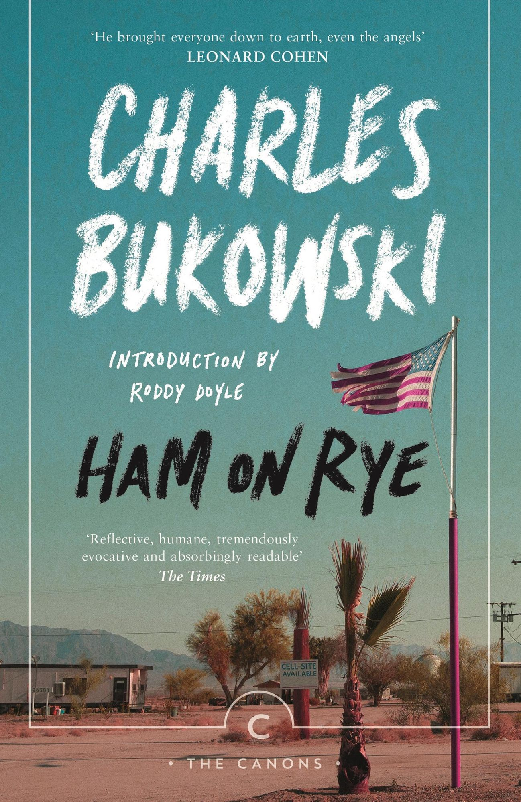

# Silent Book Club

- [Task](#task)
- [Requirements](#requirements)
- [My experiences with reading](#my-experiences-with-reading)
- [My book](#my-book)
- [Journal 1](#journal-1-getting-started)
- [Journal 2](#journal-2-fiction-the-main-idea-concept)
- [Journal 3](#journal-3-a-setting-location)
- [Journal 4](#journal-4-a-new-idea-concept)
- [Journal 5](#journal-5-a-surprising-fact)
- [Journal 6](#journal-6-reflection)

## Task

Find a book that you will read in parallel to your English class in the coming semester. It can be a novel, a non-fiction book, or a biography. You have to be ready for the class exchange with the pages read and the associated tasks hand in before the summer holidays.

If you are not sure if the chosen book is suitable for the task, contact your teacher before the beginning of the Silent Book Club.

>## Requirements
>
>
>**Length of book:** minimum 200 pages
>
>**Genre:** fiction which has not yet been made into a film or non-fiction with at least 80% running text; Below is a list of suggestions.  
>
>**Restrictions:** You must not have already read the book in another language, including German.
>
>The book must not already exist as a film or series.  
>
>**Time to read the book:** 6 school weeks, however, you get all the tasks now and can proceed more quickly if you like to.
>
>**Grade:** TBD
>

**Possible sources:** A friend, bookstore, parents, classmates, [Mediothek der TBZ](https://www.winmedio.net/tbz/#Start1), or [e-Thek](https://e-thek.overdrive.com/) for digital book in Englisch  

---

## My experiences with reading

1. How do you feel about reading a book in English class? Are you looking forward to it or not? Why?  

    - _I'm not really looking forward to it, since I find it challenging to read in a foreign language and I'm not sure if I'll enjoy the book._

2. Do you read often? Have your reading habits changed over the years?

    - _I used to read more as a child, especially fantasy books. Nowadays, I read less fiction and more articles or specific books that interest me, like technical books or articles about technology._

3. What was a favourite book when you were a child?  

    - _Peter Pan, Harry Potter_

4. What do you gain from reading a book?  

    - _I gain new perspectives, knowledge, and sometimes a sense of escape from reality._

5. What difficulties may arise for you?

    - _I might struggle with understanding complex language or cultural references, especially if the book is set in a different time or place than I am used to. Additionally, finding the time to read can be challenging with my busy schedule._

---

## My book

_Image 1: Ham on Rye by Charles Bukowski_

1. Give the author and title of the book.

    - _Charles Bukowski, Ham on Rye_

2. Number of pages:

    - _349_

3. Why have you chosen this book?

- _I bought it last year in Dublin after I read the German version of "Absence of the Hero: Uncollected Stories and Essays, Volume 2". Bukowski's writing style and themes resonate with me, and I wanted to explore more of his work._

## Journal 1: Getting started
>
>| Pages read | and time needed: |
>|------------|------------------|
>|     42     |       1h40min    |

- What happened? Summarize in 5-10 sentences.

  - _In the first chapters, we are introduced to Henry Chinaski’s early childhood. He grows up in a poor family during the Great Depression. His father is emotionally cold and physically abusive, and his mother is passive. Henry begins to notice the hypocrisy of adults and feels like an outsider early on. The first signs of alienation, anger, and confusion start to build in him. He doesn't fit in with other kids and feels embarrassed about his background. This leads to frustration and emotional withdrawal. The style is very direct and raw.

- Does the book live up to your expectations so far, or is it different from what you expected?

  - _At this moment, it's hard to tell. The story is mostly focused on Henry's internal struggles and feelings of alienation. This makes the story a pretty sad one so far._

>|   New words   |     Definition/ Translation      |
>|---------------|----------------------------------|
>|  Cracker Box  | An uncomfortably small and boxy   house or car                                     |
>| ne'er-do-well | A person who is lazy or irresponsible (Tunichtgut)|
>|  Stoop        | A small staircase, typically outside a house, leading to the entrance door.         |

## Journal 2: Fiction The main idea/ concept
>
>| Pages read | and time needed: |
>|------------|------------------|
>|    42-82   |        2h        |
>

- Make a mind map on a sheet of paper of all protagonists you read about so far and indicate the relationships between the people. Mark the main protagonist(s) in bold.

  
  _Image 2: Mind Map of Main Characters_

Choose one of the main characters and describe them (looks, character). Explain why you like or dislike this person.

- _Henry's father is described as a large man, six feet two inches tall, characterized by curly hair, a big nose, a big mouth, and prominent eyebrows. When angry, his face would be red and flushed, appearing "all ears, nose, mouth", and he was noted for his "dark and evil eyebrows". As he aged, he developed a pot belly that later sagged, along with "folds of flesh under his chin and around his neck"_

  _My dislike for Henry's father stems from his profound cruelty and emotional oppression towards Henry. His relentless physical abuse, coupled with his constant criticism and the hypocritical facade he maintained, created an extremely damaging environment. This character embodies the "deceivers who make you feel bad", directly contributing to much of Henry's pain and feelings of alienation._

| New words | Definition/ Translation       |
|----------|--------------------------------|
| Pigeon-toed  | Having feet that turn inward                |
| Umpire  | A Referee in a game, especially in baseball                |
|Repugnant  | Extremely distasteful or unacceptable|
| Typhoid Mary | A person who spreads disease without showing symptoms themselves, named after an infamous carrier of typhoid fever in the early 20th century. |

## Journal 3: A setting/ location
>
>| Pages read | and time needed: |
>|------------|------------------|
>|   82-165   |      3h30min     |

1. Why is this place important for the story? What is meaning, is significance?

    - _Henry starts to visit the Public Library regularly, which becomes a refuge for him. It symbolizes his desire for knowledge and escape from his troubled home life. The library is a place where he can explore new ideas and find solace in books._

2. Google a picture that looks similar to the place you described and paste it here. Give the source (the URL).

    
    _Image 2: Baldwin Hills Public Library_

| New words | Definition/ Translation       |
|----------|--------------------------------|
| Shunned  | Persistently avoided, ignored, or rejected                |
| Fop   | A man who is excessively concerned with his appearance and clothes; a dandy. |
| Loitering | Hanging around a place with no purpose, often in a way that is considered annoying or disruptive.                |

## Journal 4: A new idea/ concept
>
>| Pages read | and time needed: |
>|------------|------------------|
>|   165-199  |        1h        |

- By now, you have read about several ideas or concepts. Choose one new specific idea/concept that you have learned about in your book. Explain the idea/concept.

  - _The new idea that I have learned about in the book is the power and utility of "beautiful lies" and deception as a means to navigate and even succeed in a hypocritical and often cruel world.When writing an essay about the Presidents arrival, which Henry couldn't even attend, he just fabricated a story about it. His teacher thinks his essay is very creative and Henry afterwards reflects: "So, that’s what they wanted: lies. Beautiful lies. That’s what they needed. People were fools. It was going to be easy for me."_

- Critical thinking: What is your opinion about it? Are there any valid criticisms or problems you see with this idea/concept?

  - _My opinion about this idea of "beautiful lies" is that while it is presented as a pragmatic and almost necessary coping mechanism for Henry within the extremely difficult and unsupportive environment he inhabits, it is ultimately a deeply cynical and self-destructive strategy. Because while it may provide temporary relief or success, it also erodes trust and authenticity, both in oneself and in relationships with others._

| New words | Definition/ Translation       |
|----------|--------------------------------|
| scourge  | A person or thing that causes great trouble or suffering.                |

## Journal 5: A surprising fact
>
>| Pages read | and time needed: |
>|------------|------------------|
>|  199-280   |        2h        |
>
-

- Describe a fact/finding that you learned about in your book that surprised you.

  - _A fact that surprised me  is Henry Chinaski's sudden and brutal capacity to win physical fights against individuals who are seemingly stronger or more socially dominant than him. This is particularly evident in his victories over Jimmy Newhall, the "golden boy" athlete, and his physically powerful friend, Robert Becker._

- Explain why it surprised and why you did not expect this.

  - _It was surprising for me, because Henry had always been portrayed as a victim of physical abuse, someone who was more likely to be bullied than to stand up for himself. To see him suddenly excel in physical confrontations was unexpected._

| New words | Definition/ Translation       |
|----------|--------------------------------|
| perfunctory  | Carried out with a minimum of effort or reflection.                |

## Journal 6: Reflection

- How was it for you to read this book? Describe your feelings about the reading experience.

  - _For me, reading Ham on Rye was a really sad experience.
  It shows how hard life can be, and how loneliness and pain can shape a person’s whole world._

    _Even though Henry finds his own way to survive, his story made me really feel the weight of his struggles and isolation._

    _I think it’s important to see how these experiences shape a person’s life and identity.
    Bukowski shows Henry’s difficult journey in a way that is both sad and makes us think.
    His story also reminds us that people can be strong, even when life is very hard._

- What you have learned from this read? Write down your main insight or a scene that impressed you and that you would like to remember.

  - _A very powerful scene happens when, after years of being beaten with a razor strop, Henry suddenly loses his fear during one of these beatings. Instead, he tells his father, “Give me a couple more.” This emotional change is important, because it marks the end of the physical abuse. For the first time, Henry sees that his father is actually weak and tired, with “tired pink putty” eyes instead of his usual fierce look._

    _This moment shows that Henry is becoming stronger and more resilient. He starts to understand that people who seem powerful—like his father—are not always as strong as they appear. Henry’s ability to stand up to his father means he is learning to defy, not just survive, the difficult people and situations in his life._  
