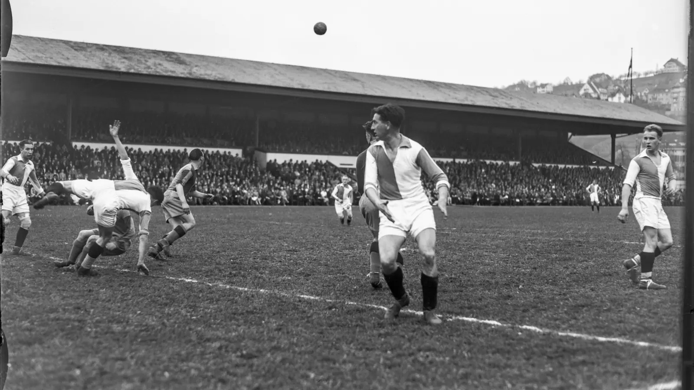
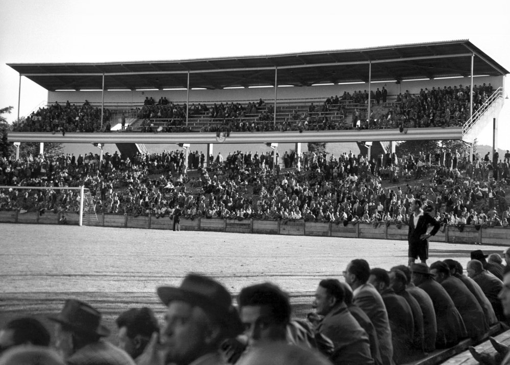
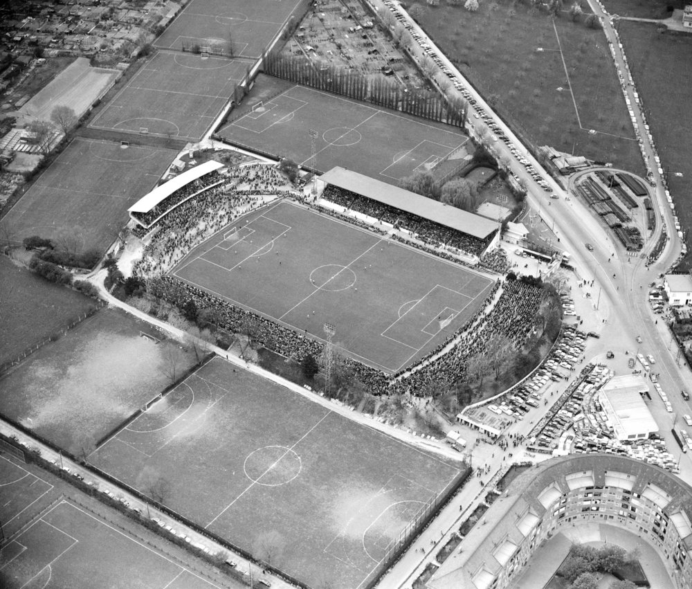
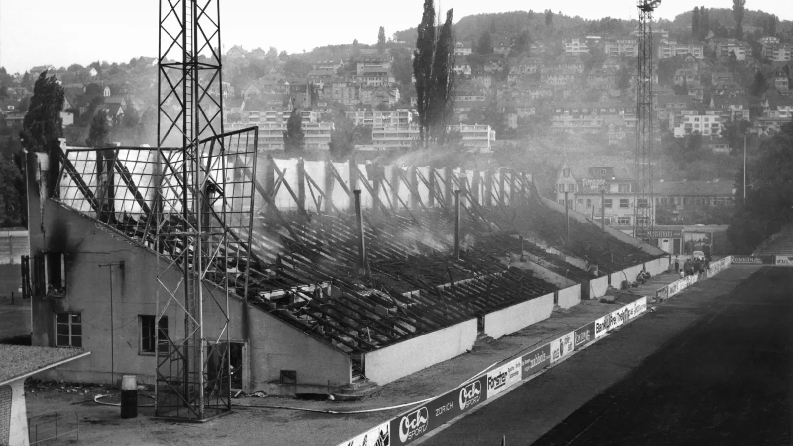
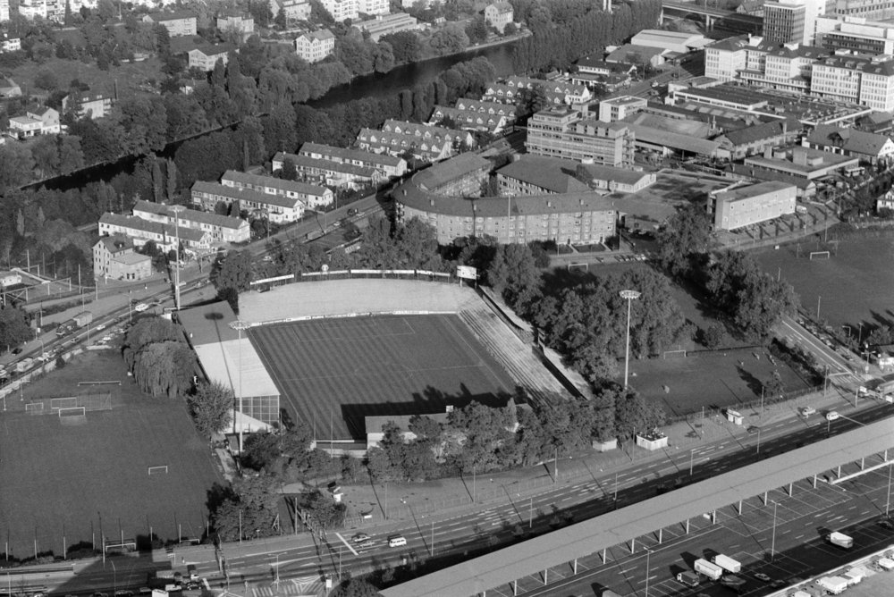
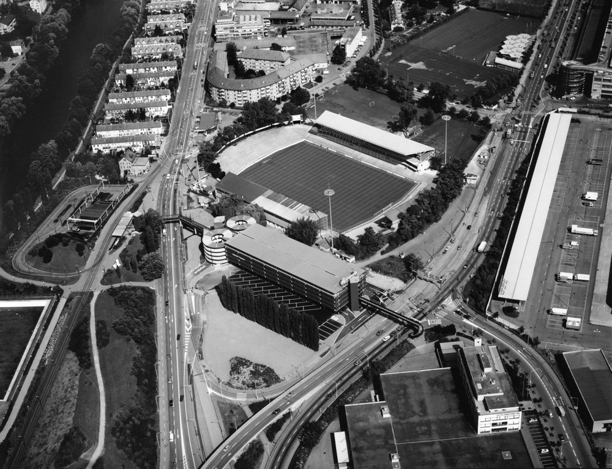
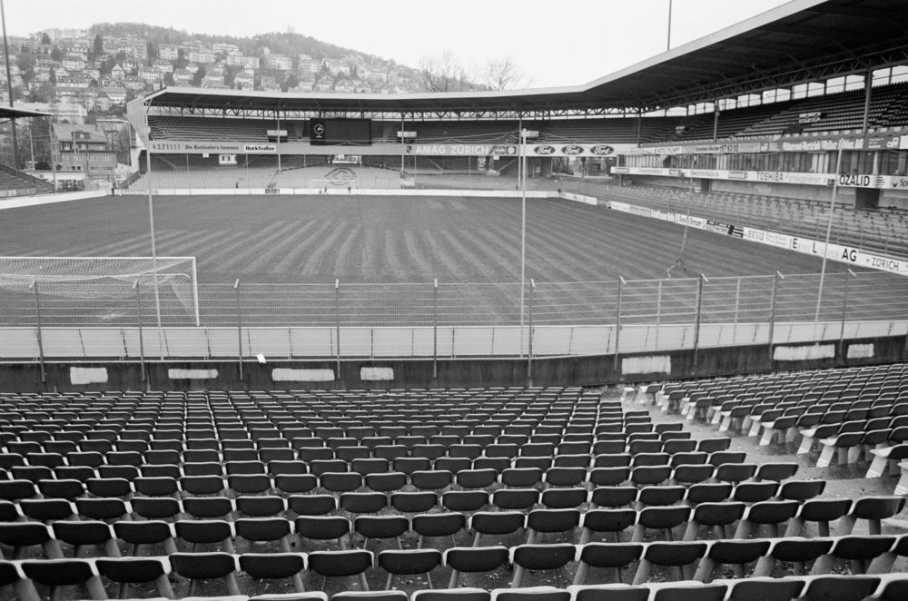
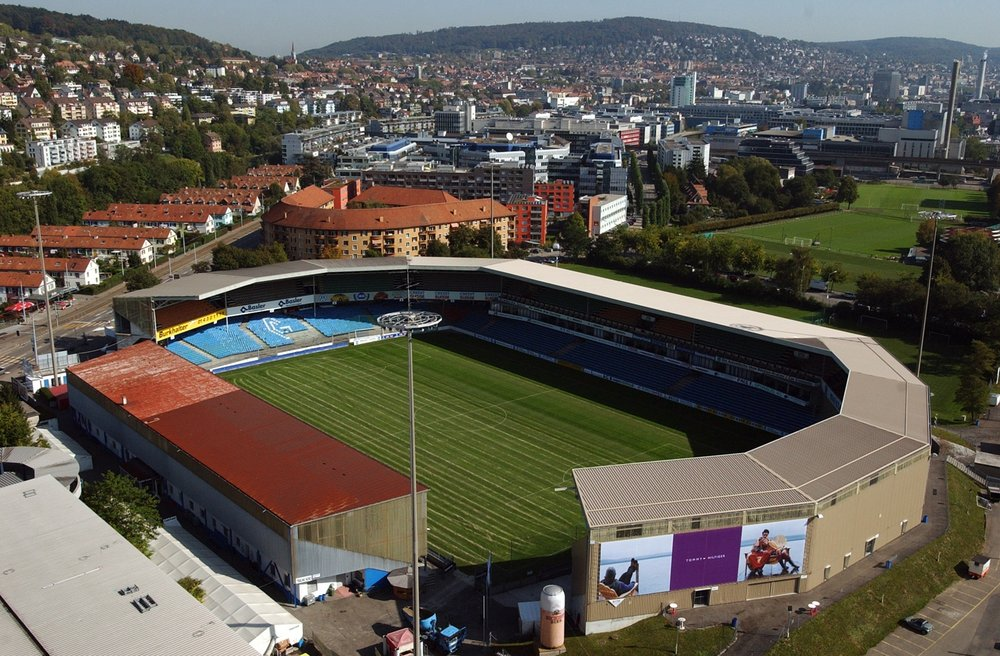

Notes

This is the Backlog for my English Vlog about **Hardturm Stadion**

- It should be at least 2:30 long
- The language should be flawless
- Voice over / Off-Voice is allowed

## Pictures

_Hauptribüne 1933_

_Blick auf die in den 50er Jahren erstellte Treml-Tribüne des Hardturmstadions._

_Luftaufnahme 1954 (FIFA World Cup)_

_Tribüne nach Brand 1968_

_Luftaufnahme im Jahr 1980, vor dem Neubau der Süd- und Ostttibünen._

_Luftaufnahme 1985, nach dem Bau der Gegentribüne._

_Aufnahme aus dem Jahr 1993, die neue Gegentribüne (rechts) und Estrade Ost (Mitte)._

_Das Hardturm Stadion in seiner letzten Form._